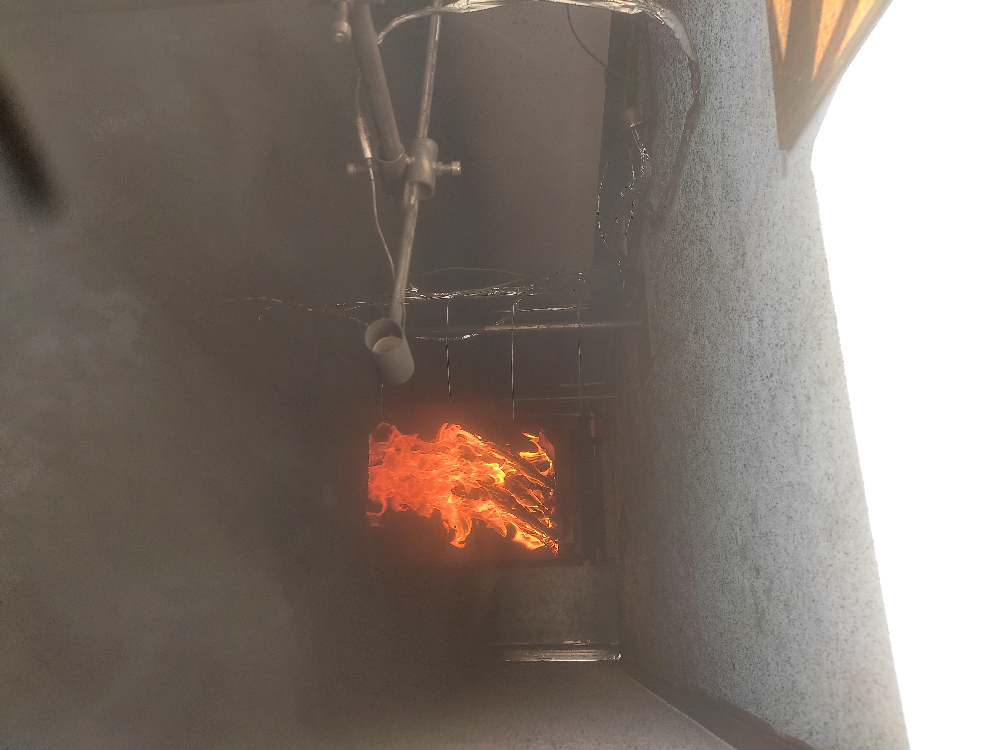

<section>
  <h1 class="gradient-text section-title" data-i18n="exp.title">Experimental Gallery</h1>
  

    A selection of images showcasing my experimental work across fire safety, fluid mechanics, and thermal studies.
  

  

    

      

        
        OUALID IKHOU
      

      

        <h3 style="margin:0.5rem 0; color:var(--text-primary);" data-i18n="exp.1.title">Helium Jet Impact on an Inclined Wall</h3>
        

          Experimental visualization of a helium jet impinging on an inclined wall. The experiment highlights the jet deflection, mixing mechanisms, and flow structures generated by the interaction between the buoyant helium jet and the solid surface.
        

      

    

    

      

        
        OUALID IKHOU
      

      

        <h3 style="margin:0.5rem 0; color:var(--text-primary);" data-i18n="exp.2.title">Wood Thermal Degradation with Sliding Cone Calorimeter</h3>
        

          Experimental study of wood thermal degradation using a vertically mounted sample exposed to a sliding cone calorimeter. The movable heating system allows the heat flux to be adjusted during the experiment, enabling the observation of ignition, flame spread, and pyrolysis behavior under varying thermal conditions.
        

      

    

    

      

        
        OUALID IKHOU
      

      

        <h3 style="margin:0.5rem 0; color:var(--text-primary);" data-i18n="exp.3.title">Wood Flame in a Scaled Firefighter Training Compartment</h3>
        

          Experimental visualization of a wood flame burning inside a reduced-scale model of a firefighter training compartment. The flame develops in the combustion chamber, while a hot smoke layer propagates through the observation corridor.
        

      

    

    

      

        
        OUALID IKHOU
      

      

        <h3 style="margin:0.5rem 0; color:var(--text-primary);" data-i18n="exp.4.title">Backdraft Phenomenon</h3>
        

          Visualization of the backdraft phenomenon during a firefighter training exercise in a controlled compartment, highlighting rapid flame propagation and smoke ignition.
        

      

    

  

</section>
