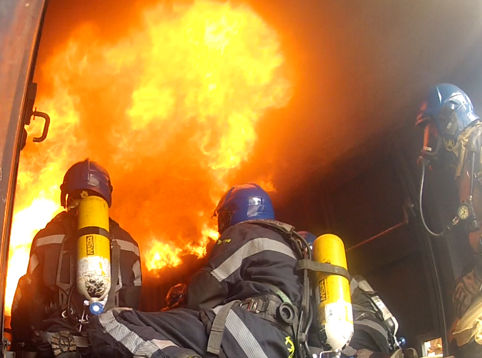
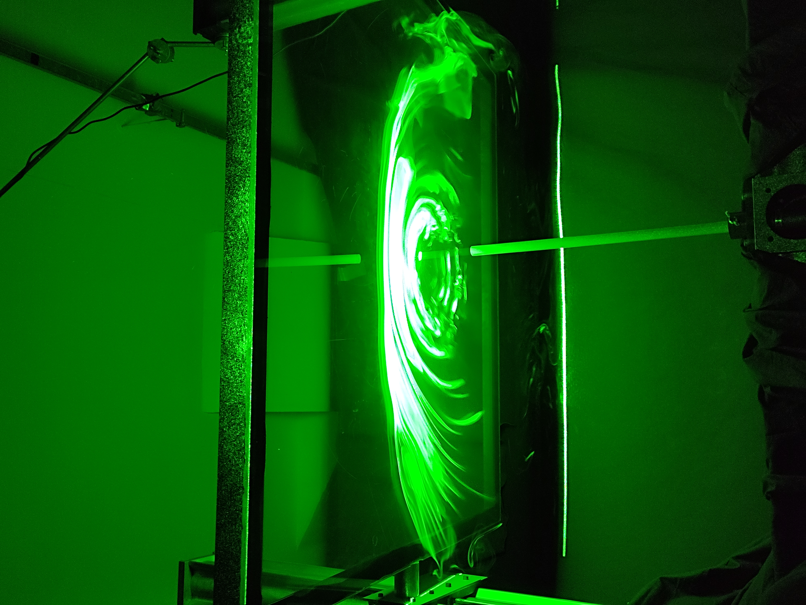
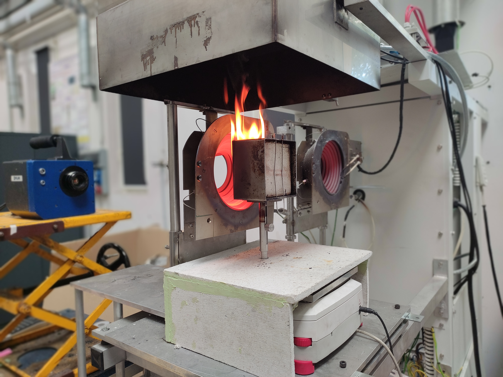

<section>
  <h1 class="gradient-text">Experimental Gallery</h1>
  <p class="hero-bio">
    A selection of images showcasing my experimental work across fire safety, fluid mechanics, and thermal studies.
  </p>

  <div class="experiments-grid" style="display: grid; grid-template-columns: repeat(auto-fill, minmax(350px, 1fr)); gap: 2rem; margin-top: 3rem;">
    
    <!-- Experiment 1 -->
    <div class="experiment-card" style="background: var(--glass-bg); border-radius: 16px; border: 1px solid var(--glass-border); overflow: hidden; transition: transform 0.3s ease;">
      <div class="image-container" style="height: 250px; overflow: hidden; background: #1a1a1a; display: flex; align-items: center; justify-content: center; position: relative;">
        <!-- Replace 'assets/img/photo1.jpg' with your actual image path -->
        
        <span style="position: absolute; color: white; font-size: 0.8rem; opacity: 0.5;">OUALID IKHOU</span>
      </div>
      <div style="padding: 1.5rem;">
        <!-- <span style="font-size: 0.75rem; color: var(--accent-blue); text-transform: uppercase; font-weight: 700; letter-spacing: 1px;">Research • Experiment</span> -->
        <h3 style="margin: 0.5rem 0; color: var(--text-primary);">Backdraft Phenomenon</h3>
        <p style="color: var(--text-secondary); font-size: 0.95rem; line-height: 1.6;">
          Visualization of the backdraft phenomenon during a firefighter training exercise in a controlled compartment, highlighting rapid flame propagation and smoke ignition.
        </p>
      </div>
    </div>
    
    <!-- Experiment 2 -->
    <div class="experiment-card" style="background: var(--glass-bg); border-radius: 16px; border: 1px solid var(--glass-border); overflow: hidden; transition: transform 0.3s ease;">
      <div class="image-container" style="height: 250px; overflow: hidden; background: #1a1a1a; display: flex; align-items: center; justify-content: center; position: relative;">
        <!-- Replace with your image -->
        
        <span style="position: absolute; color: white; font-size: 0.8rem; opacity: 0.5;">OUALID IKHOU</span>
      </div>
    
      <div style="padding: 1.5rem;">
        <h3 style="margin: 0.5rem 0; color: var(--text-primary);">Helium Jet Impact on an Inclined Wall</h3>
        
        <p style="color: var(--text-secondary); font-size: 0.95rem; line-height: 1.6;">
          Experimental visualization of a helium jet impinging on an inclined wall. 
          The experiment highlights the jet deflection, mixing mechanisms, and flow structures 
          generated by the interaction between the buoyant helium jet and the solid surface.
        </p>
      </div>
    </div>
    <!-- Experiment 3 -->
    <div class="experiment-card" style="background: var(--glass-bg); border-radius: 16px; border: 1px solid var(--glass-border); overflow: hidden; transition: transform 0.3s ease;">
      <div class="image-container" style="height: 250px; overflow: hidden; background: #1a1a1a; display: flex; align-items: center; justify-content: center; position: relative;">
        
        <!-- Replace with your image -->
        
        
        <span style="position: absolute; color: white; font-size: 0.8rem; opacity: 0.5;">OUALID IKHOU</span>
      </div>
    
      <div style="padding: 1.5rem;">
        
        <h3 style="margin: 0.5rem 0; color: var(--text-primary);">
          Wood Thermal Degradation with Sliding Cone Calorimeter
        </h3>
    
        <p style="color: var(--text-secondary); font-size: 0.95rem; line-height: 1.6;">
          Experimental study of wood thermal degradation using a vertically mounted sample 
          exposed to a sliding cone calorimeter. The movable heating system allows the heat 
          flux to be adjusted during the experiment, enabling the observation of ignition, 
          flame spread, and pyrolysis behavior under varying thermal conditions.
        </p>
    
      </div>
    </div>
    <!-- Experiment 4 -->

    <div class="experiment-card" style="background: var(--glass-bg); border-radius: 16px; border: 1px solid var(--glass-border); overflow: hidden; transition: transform 0.3s ease;">
      <div class="image-container" style="height: 250px; overflow: hidden; background: #1a1a1a; display: flex; align-items: center; justify-content: center; position: relative;">
    
    ```
    <!-- Replace with your image -->
    
    
    <span style="position: absolute; color: white; font-size: 0.8rem; opacity: 0.5;">OUALID IKHOU</span>
    ```
    
      </div>
    
      <div style="padding: 1.5rem;">
    
    ```
    <h3 style="margin: 0.5rem 0; color: var(--text-primary);">
      Wood Flame in a Scaled Firefighter Training Compartment
    </h3>
    
    <p style="color: var(--text-secondary); font-size: 0.95rem; line-height: 1.6;">
      Experimental visualization of a wood flame burning inside a reduced-scale model 
      of a firefighter training compartment. The flame develops in the combustion chamber, 
      while a hot smoke layer propagates through the observation corridor. This setup 
      allows the study of flame dynamics, smoke stratification, and fire development in 
      confined structures representative of firefighter training environments.
    </p>
    ```
    
      </div>
    </div>

  </div>
</section>

<style>
  .experiment-card:hover {
    transform: translateY(-10px);
    border-color: var(--accent-blue) !important;
    box-shadow: 0 10px 30px rgba(0,0,0,0.3);
  }
</style>
